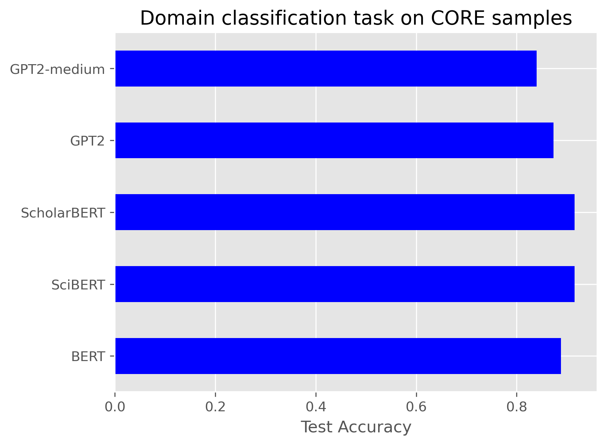
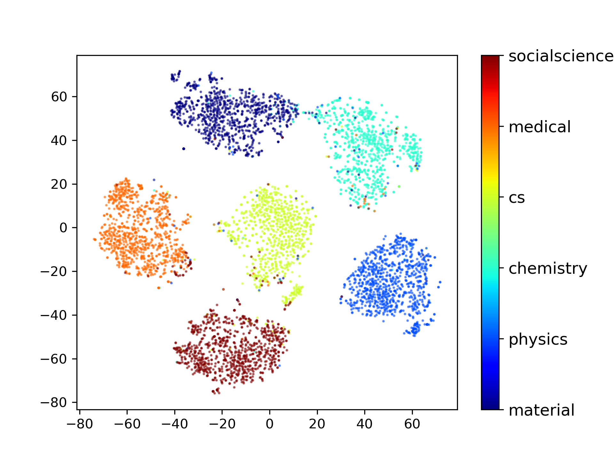
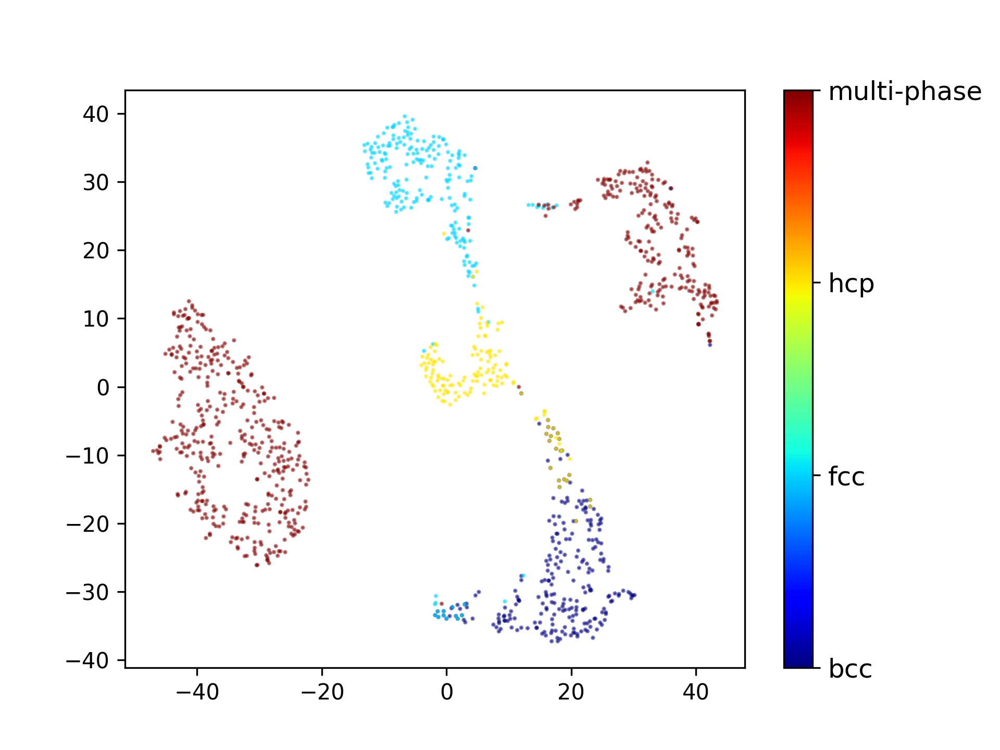

# Classification 
We propose domain subject classification and alloy phase classification tasks. 

## Domain 
The [labelled dataset](https://www.dropbox.com/s/dck76b3ipsbp61m/domains.csv?dl=0) is generated by randomly sampling domain journals in CORE data. 
- Fine tune and validate on domains text, e.g.
```
python llm-classifier.py  --model globuslabs/ScholarBERT --emb-size 1024
```
- Test accuracy on CORE samples: 

- Clustering on embeddings: 

## Phase
The [labelled datatset](./phase/alloys_phases.csv) is obtained from https://www.nature.com/articles/s41524-020-0308-7 

- Fine tune and cluster alloy phases based on material names: 

The deepspeed parallelization for the fine-tuning codes are also provided for above 2 tasks, respectively. E.g., to run it on Summit 
```bash
bsub phase/launch_classifier_phase.lsf 
```

